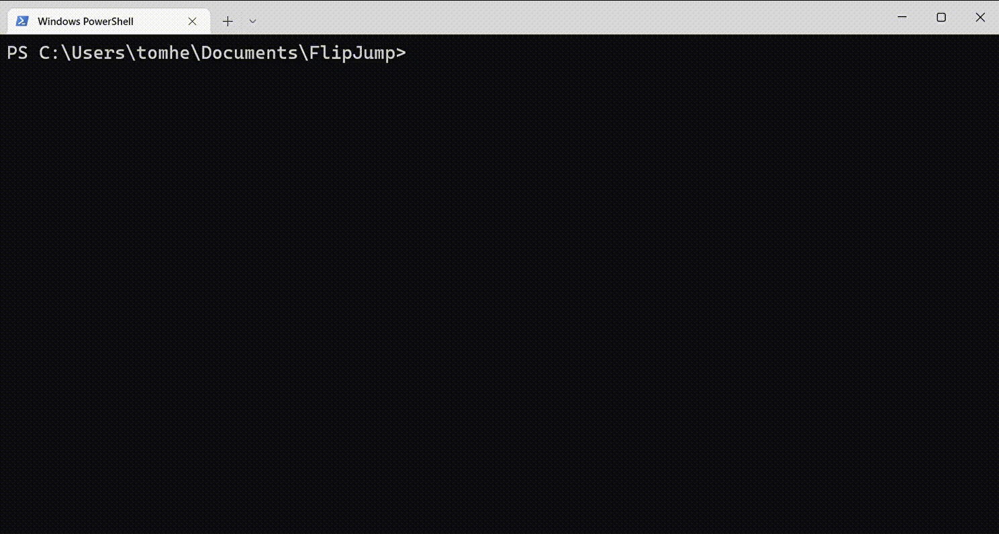
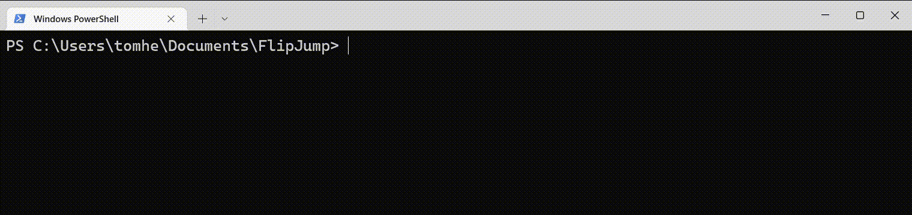

# FlipJump

[](https://github.com/tomhea/flip-jump#project-structure)
[](https://github.com/tomhea/flip-jump/releases/latest)
[](https://github.com/tomhea/flip-jump/discussions)
[](LICENSE)
[](https://esolangs.org/wiki/FlipJump)
[](https://pypi.org/project/flipjump/)

FlipJump is the simplest programing language.  
Yet, it can do **any modern computation**.

It's an Esoteric language ([FlipJump esolangs page](https://esolangs.org/wiki/FlipJump)), with just 1 operation `a;b`:  
- `not *a; jump b`

Which means - **Flip** a bit, then **Jump**.

The operation takes 2 memory addresses - it flips (inverts) the bit the first address points to, and jumps to (continue execution from) the second address. The next opcode is the two memory-addresses found right where you jumped to. You flip and jump again, and so on...  


This project includes a **Macro Assembler**, an **Interpreter**, and a **Thoroughly Tested Standard Library** for the FlipJump language.  
Additionally, it provides a **Python Library** that makes it easy to work with those components.

This calculator was built with only FlipJump ([source](programs/calc.fj)):


## Hello, World!

<details>
  <summary>A simple hello-world flipjump program, not using the standard library:</summary>
(jump to the source code)

```c
// define macros that will be used later

// this macro exports the "IO" label to be a global label
def startup @ code_start > IO  {
    ;code_start
  IO:
    ;0              // the second op is reserved for Input/Output.
  code_start:
}

// this macro gets one parameter "bit", and uses the global label "IO".
def output_bit bit < IO {
    IO + bit;       // flipping IO+0 outputs 0; flipping IO+1 outputs 1.
}
def output_char ascii {
    // the next line will be unwinded into 8 output_bit macro-uses, each with a different parameter
    rep(8, i) output_bit ((ascii>>i)&1)
}

def end_loop @ loop_label {
    loop_label:
    ;loop_label     // a flipjump program finishes on a self loop
}


// The first lines of actual code:

    startup
    
    output_char 'H'
    output_char 'e'
    output_char 'l'
    output_char 'l'
    output_char 'o'
    output_char ','
    output_char ' '
    
    output_char 'W'
    output_char 'o'
    output_char 'r'
    output_char 'l'
    output_char 'd'
    output_char '!'
    
    end_loop

```

The source code can be found here: [hello_no-stl.fj](programs/print_tests/hello_no-stl.fj).

The FlipJump assembly supports a ```"Hello, World!"``` syntax for initializing a variable with a string value.
Look at the [hello_world.fj](programs/print_tests/hello_world.fj) program for more info.

Note that all of these macros are already implemented in the standard library (all in [runlib.fj](flipjump/stl/runlib.fj)):
- startup
- end_loop     (loop)
- output_char
- output       (for printing string consts, e.g. output "Hello, World!")
</details>


# How to install?

```shell
pip install flipjump
```

You can also install it with its extras:
- flipjump[**stats**]: support for viewing macro usage in an interactive graph.
- flipjump[**tests**]: all the testing libraries needed.
```shell
pip install flipjump[stats,tests]
```


Pycharm Extensions:
- Add <span style="color:orange">syntax highlighting</span> support for *.fj files - just import the [PycharmHighlighting.zip](ide-extensions/pycharm/PycharmHighlighting.zip) settings.
- Add a ctrl+shift+click (find fj-macro definition) functionality by using the [AutoHotKey script](ide-extensions/pycharm/fj-pycharm-def-finder.ahk).

# How to run?

Use the `fj` utility:
```shell
fj hello_world.fj
```



  - The --no-stl flag tells the assembler not to include the standard library. for example: `fj programs/print_tests/hello_no-stl.fj --no-stl`.
  - the -w [WIDTH] flag allows compiling the .fj files to a WIDTH-bits memory width. WIDTH is 64 by default.
  - You can use the -o flag to save the assembled file for later use too.
  - you can find all the different flags with `fj -h`.

You can also **[Test the project](tests/README.md)** with the project's tests, and with your tests.

You can also assemble and run separately:

```bash
fj --asm hello.fj -o hello_world.fjm
fj --run hello_world.fjm
```

- The first line will assemble your code.
- The second line will run your code.

You can also use the faster [cpp-based interpreter](https://github.com/tomhea/fji-cpp):

```bash
>>> fji hello.fjm -s
Hello, World!
```

### How to Debug?
Programs won't work on their first run. They just can't. That's why we support the next debugging flags.

- No debugging flags at all: Shows the last 10 executed addresses of tests that failed their run (i.e. finished not by looping). 
- `-d [PATH]`: Save debug information: Adds [very extensive label names](tests/README.md#example-label-name-youll-get-with-using---debuginfo-len), Which are like a "**macro-stack**" for each of the last executed address. (can be used with `--debug-ops-list LEN`)
- `--debug-ops-list LEN`: Shows the last _LEN_ executed addresses (instead of 10). (can be used with `-d`)
- `-b NAME [NAME ...]`: Places breakpoints at every specified label NAMEs (note that label names are long: [more information about labels](flipjump/README.md#generated-label-names)). (requires `-b`)
- `-B NAME [NAME ...]`: Places breakpoints at every label that contains one of the given NAMEs. (requires `-b`)


# Get Started with FlipJump
- Install flipjump: `pip install flipjump`
- Write your flipjump program (use the [stl - standard library](flipjump/stl/README.md) macros).
  - For example: [print_dec.fj](programs/print_tests/print_dec.fj).
- assemble+run your program: `fj print_dec.fj`

### Example usage of the flipjump python library
```python
from pathlib import Path
from flipjump import assemble_and_run  # assemble, run_test_output, ...

fj_file_paths = [Path('path/to/main.fj'), Path('path/to/consts.fj')]
termination_statistics = assemble_and_run(fj_file_paths)
```

_You can also use the `flipjump.assemble_run_according_to_cmd_line_args(cmd_line_args=[...])`._


# Project Structure

**[flipjump](flipjump/README.md)** (assembler + interpreter source files):
  - [flipjump_cli.py](flipjump/flipjump_cli.py) - Main CLI script fot the FlipJump Assembler & Interpreter.
  - [fjm/](flipjump/fjm) - Tools for reading/writing .fjm (flip-jump-memory) files.
  - [interpreter/fjm_run.py](flipjump/interpretter/fjm_run.py) - Interpreter + debugger for assembled fj files.
  - [assembler/](flipjump/assembler) - Components for assembling FlipJump code.
    - [fj_parser.py](flipjump/assembler/fj_parser.py) - Pythonic lex/yacc parser.
    - [preprocessor.py](flipjump/assembler/preprocessor.py) - Unwinds all macros and reps (repetitions).
    - [assembler.py](flipjump/assembler/assembler.py) - Assembles macro-less fj files.
  - [more...](flipjump/README.md) - Additional project files and documentation.

**[flipjump/stl](flipjump/stl/README.md)** (standard library files - macros. The [stl readme](flipjump/stl/README.md#the-files) contains the list of all macros):
  - runlib.fj - Constants and initialization macros. Output constant strings.
  - [bit/](flipjump/stl/README.md#bit) - Directory of stl files. Macros for io/manipulating binary variables and vectors (i.e. numbers): math, logic, conditional jumps, pointers, casting, IO, ...
  - [hex/](flipjump/stl/README.md#hex) - Directory of stl files. Macros for io/manipulating hexadecimal variables and vectors (i.e. numbers): math, logic, conditional jumps, pointers, casting, IO, ...
  - mathlib.fj - Advanced math macros (mul/div).
  - casting.fj - Macros for casting between bit/hex.
  - ptrlib.fj - Macros for working with pointers, stacks, and functions.
  - conf.json - The list of the standard library files.

**[programs](programs)** (flipjump programs, used by the tests), for example:
  - [hello_world.fj](programs/print_tests/hello_world.fj) - Prints "hello world :)"
  - [calc.fj](programs/calc.fj) - A command-line calculator for 2 hex/dec numbers: ```a [+-*/%] b```.
  - [func_tests/](programs/func_tests) - Programs for testing function calls and stack operations.
  - [hexlib_tests/](programs/hexlib_tests) - Tests for all the hex macros, except the hex.pointers.
  - [quine16.fj](programs/quine16.fj) - A 16-bits quine by [lestrozi](https://github.com/lestrozi); when assembled with `-w16 -v0` - prints itself.
  - [pair_ns.fj](programs/concept_checks/pair_ns.fj) - Simulates the concept of a Class, by using a namespace.
  - [print_dec.fj](programs/print_tests/print_dec.fj) - Prints binary variables as decimals.
  - [multi_comp/](programs/multi_comp) - Simulates a big project (compilation of multiple files).

**[tests](tests/README.md)** (tests compiling+running the programs with the stl), for example:
  - compiled/ - The designated directory for the assembled tests files.
  - inout/ - Contains the .in and .out files for each test.
  - conftest.py - The pytest configuration file. The tests are being generated here.
  - test_fj.py - The base test functions for compilation and running ([how to run](tests/README.md#run-the-tests)).
  - test_compile_*.csv - Arguments for the compile tests ([compile test arguments format](tests/README.md#compile-csvs-format)).
  - test_run_*.csv - Arguments for the run tests ([run test arguments format](tests/README.md#run-csvs-format)).
  - conf.json - The tests groups+order lists.
  - xfail_*.csv - [xfail](https://docs.pytest.org/en/7.1.x/how-to/skipping.html#xfail-mark-test-functions-as-expected-to-fail) these tests.


# Read More - Extra Documentation

Take a look at the other READMEs:
* Read more about the [assembler/interpreter source files](flipjump/README.md).    
* Read more about [how to run the tests](tests/README.md).
* Read more about the [standard library](flipjump/stl/README.md).

A very extensive explanation can be found on the [GitHub wiki page](https://github.com/tomhea/flip-jump/wiki/Learn-FlipJump).

More detailed explanation and the **specifications of the FlipJump assembly** can be found on the [FlipJump esolangs page](https://esolangs.org/wiki/FlipJump).

If you are new to FlipJump and you want to learn how modern computation can be executed using FlipJump, and you want to jump onto your first flipjump code - Start by reading the [bit.xor](flipjump/stl/bit/logics.fj) and [bit.if](flipjump/stl/bit/cond_jumps.fj) macros. That's where the FlipJump magic begins.  
If you want to understand how the deep optimized hex macros work, understand how the next macros are implemented: [hex.exact_xor](flipjump/stl/hex/logics.fj), [hex.output](flipjump/stl/hex/output.fj), [hex.inc1](flipjump/stl/hex/math_basic.fj), and [hex.add](flipjump/stl/hex/math.fj) (understand the concept of the [lookup tables](https://esolangs.org/wiki/FlipJump#Lookup_Tables).

You can also write and run programs for yourself! It is just [that](README.md#how-to-run) easy :)


# Contribute

If you want to contribute to this project, read the [CONTRIBUTING.md](CONTRIBUTING.md) file, and take a look at the [I-Want-To-Contribute Thread](https://github.com/tomhea/flip-jump/discussions/148).

Actually, just writing your own flipjump programs and sharing them with the world is a great contribution to the community :)  
Take a look at what the [standard library](flipjump/stl/README.md) offers, and see some [example programs](programs) to get you inspired!
