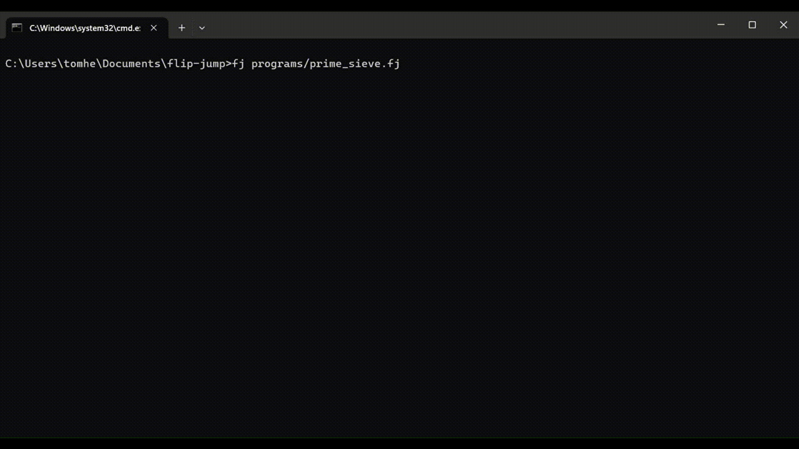
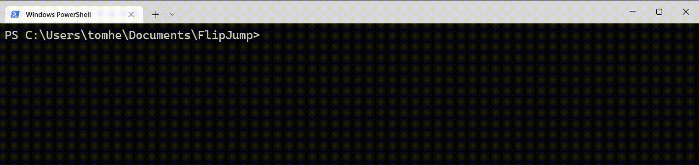

# FlipJump

[](https://github.com/tomhea/flipjump/actions/workflows/tests.yml)
[](https://pypi.org/project/flipjump/)
[](https://github.com/psf/black)
[](http://mypy-lang.org/)  
[](https://esolangs.org/wiki/FlipJump)
[](https://github.com/tomhea/flipjump/discussions)
[](https://mango-dune-07a8b7110.1.azurestaticapps.net/?repo=Tomhea%2Fflipjump)
[](LICENSE)

FlipJump is the simplest programming language.  
Yet, it can do **any modern computation**. See the [C -> FlipJump compiler](https://github.com/tomhea/c2fj).

**Try for yourself — [Online IDE](https://fj.tomhe.app).** No install needed.

It's an Esoteric language ([FlipJump esolangs page](https://esolangs.org/wiki/FlipJump)), with just 1 operation `a;b`:  
- `not *a; jump b`

Which means - **Flip** a bit, then **Jump**.

The operation takes 2 memory addresses - it flips (inverts) the bit the first address points to, and jumps to (continue execution from) the second address. The next opcode is the two memory-addresses found right where you jumped to. You flip and jump again, and so on...  


This project includes a **Macro Assembler**, an **Interpreter**, and a **Thoroughly Tested Standard Library** for the FlipJump language.  
Additionally, it provides a [**Python Library**](https://pypi.org/project/flipjump/) that makes it easy to work with those components.

This prime numbers program was coded only with FlipJump ([source](programs/prime_sieve.fj)):


## Hello, World!

<details>
  <summary>A simple hello-world flipjump program, not using the standard library:</summary>
(jump to the source code)

```c
// define macros that will be used later

// this macro exports the "IO" label to be a global label
def startup @ code_start > IO  {
    ;code_start
  IO:
    ;0              // the second op is reserved for Input/Output.
  code_start:
}

// this macro gets one parameter "bit", and uses the global label "IO".
def output_bit bit < IO {
    IO + bit;       // flipping IO+0 outputs 0; flipping IO+1 outputs 1.
}
def output_char ascii {
    // the next line will be unwinded into 8 output_bit macro-uses, each with a different parameter
    rep(8, i) output_bit ((ascii>>i)&1)
}

def end_loop @ loop_label {
    loop_label:
    ;loop_label     // a flipjump program finishes on a self loop
}


// The first lines of actual code:

    startup
    
    output_char 'H'
    output_char 'e'
    output_char 'l'
    output_char 'l'
    output_char 'o'
    output_char ','
    output_char ' '
    
    output_char 'W'
    output_char 'o'
    output_char 'r'
    output_char 'l'
    output_char 'd'
    output_char '!'
    
    end_loop

```

The source code can be found here: [hello_no-stl.fj](programs/print_tests/hello_no-stl.fj).

The FlipJump assembly supports a ```"Hello, World!"``` syntax for initializing a variable with a string value.
Look at the [hello_world.fj](programs/print_tests/hello_world.fj) program for more info.

Note that all of these macros are already implemented in the standard library (all in [runlib.fj](flipjump/stl/runlib.fj)):
- startup
- end_loop     (loop)
- output_char
- output       (for printing string consts, e.g. output "Hello, World!")
</details>


# How to install?

```shell
pip install flipjump
```

And jump right into the neat [**FlipJump Docs**](https://fjdocs.tomhe.app) site!

You can also install it with its extras:
- `flipjump[stats]`: support for viewing macro usage in an interactive graph.
- `flipjump[tests]`: all the testing libraries needed.
```shell
pip install flipjump[stats,tests]
```


**IDE Plugins:**  
FlipJump has official plugins for [JetBrains IDEs](https://plugins.jetbrains.com/plugin/32134-flipjump) and [VS Code](https://marketplace.visualstudio.com/items?itemName=flipjump.flipjump). Both offer full FlipJump syntax highlighting and "jump to definition" functionality with Ctrl+Click on a macro name.

**Claude Skill** ([repo](https://github.com/tomhea/skills)):  
Write FlipJump programs — correct, efficient, and tested. Knows the STL's macros and idioms, the gotchas, and verifies every program through the fj toolchain.
```
/plugin marketplace add tomhea/skills
/plugin install flipjump@tomhe
``` 


# How to run?

Use the `fj` utility:
```shell
fj hello_world.fj
```



  - The --no-stl flag tells the assembler not to include the standard library. for example: `fj programs/print_tests/hello_no-stl.fj --no-stl`.
  - The `-w [WIDTH]` flag allows compiling the .fj files to a WIDTH-bits memory width. WIDTH is 64 by default.
  - You can use the `-o` flag to save the assembled file for later use too.
  - You can find all the different flags with `fj -h`.

You can also **[Test the project](tests/README.md#run-the-tests)** with the project's tests, and with your own tests.

You can also assemble and run separately:

```bash
fj --asm hello.fj -o hello_world.fjm
fj --run hello_world.fjm
```

- The first line will assemble your code.
- The second line will run your code.

<details>
<summary><b>Make it fast</b> — the three interpreter engines (native C is the default, ~100-300M fj-ops/s).</summary>

The interpreter has three engines:
- **The native engine** (~100-300M fj-ops/s) - a C-extension, prebuilt in the official wheels
  (Linux glibc/musl, macOS, Windows; every CPython >= 3.10), so a plain `pip install flipjump`
  already has it. Elsewhere, build it once with `python build_fjcore.py`; it is used
  automatically whenever present (`FLIPJUMP_NO_NATIVE=1` disables it).
- **The fast loop** (~4M fj-ops/s) - pure Python, the fallback when the native engine isn't built.
- **The featured loop** - used for `--trace`/breakpoints, or with `--profile` for the full
  per-op statistics (flips/jumps percentages).

Benchmark them yourself with `python tests/benchmarks/benchmark_interpreter.py` (results and the
w=32-vs-w=64 recommendation are recorded in [tests/benchmarks/benchmark_results.md](tests/benchmarks/benchmark_results.md)).
</details>

<details>
<summary><b>IO devices</b> — pluggable input/output, including an interactive screen window and a keyboard.</summary>

The interpreter's IO is pluggable: `--io MODE` picks one complete IO device.

```bash
fj --run program.fjm --io pc
```

- **`--io standard`** (the default) - input/output over the terminal.
- **`--io pc`** - an interactive window: live keyboard input **and** a scaled 256-color screen,
  in one window the device owns (F11 toggles fullscreen, closing it stops the run). Needs
  pygame (`pip install flipjump[screen]`); works on Windows, Linux and macOS.

Each mode is one complete `IODevice` that owns its own channels (and window, if any) - there's
no input/output splitting. Adding a new device (e.g. a windowed text console, or one that also
drives speakers/printer) is one entry in `IO_MODES` (`io_devices/cli_devices.py`) plus its
device class. Devices can also read the program's memory through the `DeviceMemory` hook
(`IODevice.attach_memory`) - e.g. the screen reads pixel data straight from memory. Headless /
scripted devices (a scripted keyboard + PNG frames, a plain `InMemoryScreen`, ...) are built
programmatically and passed to `fjm_run.run(io_device=...)` - e.g. `PcIO.headless(events, dir)`.
</details>

### How to Debug?

Programs won't work on their first run. They just can't.  
The interpreter ships a CLI debugger (breakpoints, single-stepping, memory and
flipjump-variable inspection) - take a look at the
[debugging documentation](flipjump/interpreter/debugging/README.md).

# Get Started with FlipJump
- Install flipjump: `pip install flipjump`
- Write your flipjump program (use the [stl - standard library](flipjump/stl/README.md) macros).
  - For example: [print_dec.fj](programs/print_tests/print_dec.fj).
- assemble+run your program: `fj print_dec.fj`

### Example usage of the flipjump Python library
```python
from pathlib import Path
from flipjump import assemble_and_run  # assemble, run_test_output, ...

fj_file_paths = [Path('path/to/main.fj'), Path('path/to/consts.fj')]
termination_statistics = assemble_and_run(fj_file_paths)
```

_You can also use the `flipjump.assemble_run_according_to_cmd_line_args(cmd_line_args=[...])`._


# Project Structure

**[flipjump](flipjump/README.md)** (assembler + interpreter source files):
  - [flipjump_cli.py](flipjump/flipjump_cli.py) - Main CLI script fot the FlipJump Assembler & Interpreter.
  - [fjm/](flipjump/fjm) - Tools for reading/writing .fjm (flipjump-memory) files.
  - [interpreter/fjm_run.py](flipjump/interpreter/fjm_run.py) - Interpreter + debugger for assembled fj files.
  - [assembler/](flipjump/assembler) - Components for assembling FlipJump code.
    - [fj_parser.py](flipjump/assembler/fj_parser.py) - Pythonic lex/yacc parser.
    - [preprocessor.py](flipjump/assembler/preprocessor.py) - Unwinds all macros and reps (repetitions).
    - [assembler.py](flipjump/assembler/assembler.py) - Assembles macro-less fj files.
  - [more...](flipjump/README.md) - Additional project files and documentation.

**[flipjump/stl](flipjump/stl/README.md)** (standard library files - macros. The [stl readme](flipjump/stl/README.md#the-files) contains the list of all macros):
  - runlib.fj - Constants and initialization macros. Output constant strings.
  - [bit/](flipjump/stl/README.md#bit) - Directory of stl files. Macros for io/manipulating binary variables and vectors (i.e. numbers): math, logic, conditional jumps, pointers, casting, IO, ...
  - [hex/](flipjump/stl/README.md#hex) - Directory of stl files. Macros for io/manipulating hexadecimal variables and vectors (i.e. numbers): math, logic, conditional jumps, pointers, casting, IO, ...
  - mathlib.fj - Advanced math macros (mul/div).
  - casting.fj - Macros for casting between bit/hex.
  - ptrlib.fj - Macros for working with pointers, stacks, and functions.
  - conf.json - The list of the standard library files.

**[programs](programs)** (flipjump programs, used by the tests), for example:
  - [hello_world.fj](programs/print_tests/hello_world.fj) - Prints "hello world :)"
  - [calc.fj](programs/calc.fj) - A command-line calculator for 2 hex/dec numbers: ```a [+-*/%] b```.
  - [func_tests/](programs/func_tests) - Programs for testing function calls and stack operations.
  - [hexlib_tests/](programs/hexlib_tests) - Tests for all the hex macros, except the `hex.pointers`.
  - [quine16.fj](programs/quine16.fj) - A 16-bits quine by [lestrozi](https://github.com/lestrozi); when assembled with `-w16 -v0` - prints itself.
  - [pair_ns.fj](programs/concept_checks/pair_ns.fj) - Simulates the concept of a Class by using a namespace.
  - [print_dec.fj](programs/print_tests/print_dec.fj) - Prints binary variables as decimals.
  - [multi_comp/](programs/multi_comp) - Simulates a big project (compilation of multiple files).

**[tests](tests/README.md)** (tests compiling+running the programs with the stl), for example:
  - compiled/ - The designated directory for the assembled test files.
  - inout/ - Contains the .in and .out files for each test.
  - conftest.py - The pytest configuration file. The tests are being generated here.
  - test_fj.py - The base test functions for compilation and running ([how to run](tests/README.md#run-the-tests)).
  - [unit/](tests/unit) - Focused unit-tests for the assembler & interpreter internals ([what they check](tests/README.md#the-unit-tests), run with `pytest --unit-tests`).
  - conf.json - The tests groups+order lists.
  - [tests_tables/](tests/tests_tables)
    - test_compile_*.csv - Arguments for the compile tests ([compile test arguments format](tests/README.md#compile-csvs-format)).
    - test_run_*.csv - Arguments for the run tests ([run test arguments format](tests/README.md#run-csvs-format)).
    - xfail_*.csv - [xfail](https://docs.pytest.org/en/7.1.x/how-to/skipping.html#xfail-mark-test-functions-as-expected-to-fail) these tests.


# Read More - Extra Documentation

Take a look at the other READMEs:
* Read more about the [assembler/interpreter source files](flipjump/README.md).    
* Read more about [how to run the tests](tests/README.md).
* Read more about the [standard library](flipjump/stl/README.md).

A very extensive explanation can be found on the [GitHub wiki page](https://github.com/tomhea/flipjump/wiki/Learn-FlipJump).

A more detailed explanation and the **specifications of the FlipJump assembly** can be found on the [FlipJump esolangs page](https://esolangs.org/wiki/FlipJump).

If you are new to FlipJump and you want to learn how modern computation can be executed using FlipJump, and you want to jump onto your first flipjump code, Start by reading the [bit.xor](https://fjdocs.tomhe.app/stl/bit/logics/xor--2.html) and [bit.if](https://fjdocs.tomhe.app/stl/bit/cond_jumps/if--3.html) macros. That's where the FlipJump magic begins.  
If you want to understand how the deep optimized hex macros work, understand how the next macros are implemented: [hex.exact_xor](https://fjdocs.tomhe.app/stl/hex/logics/exact_xor--5.html), [hex.output](https://fjdocs.tomhe.app/stl/hex/output/output--1.html), [hex.inc1](https://fjdocs.tomhe.app/stl/hex/math_basic/inc1--3.html), and [hex.add](https://fjdocs.tomhe.app/stl/hex/math/add--2.html) (understand the concept of the [lookup tables](https://esolangs.org/wiki/FlipJump#Lookup_Tables).

You can also write and run programs for yourself! It is just [that](README.md#how-to-run) easy :)

## Turing Complete?
As the language expects a finite memory, like most of today's programming languages, it's technically not Turing complete. 
Yet, It's very capable.

I wrote a [Brainfuck to Flipjump Compiler (bf2fj)](https://github.com/tomhea/bf2fj) to emphasize just that. 
Brainfuck is indeed Turing complete, and the compiler proves that flipjump can run any program that brainfuck runs (besides those that require unbounded memory).

A newer project is [c2fj](https://github.com/tomhea/c2fj) - It can compile any C program to FlipJump.  
Take a look at the [prime numbers c program](https://github.com/tomhea/c2fj/blob/main/tests/programs/primes/main.c) that can be compiled to fj just as is.

# Contribute

If you want to contribute to this project, read the [CONTRIBUTING.md](CONTRIBUTING.md) file and take a look at the [I-Want-To-Contribute Thread](https://github.com/tomhea/flipjump/discussions/148).

Actually, just writing your own flipjump programs and sharing them with the world is a great contribution to the community :)  
Take a look at what the [standard library](flipjump/stl/README.md) offers ([stl docs](https://fjdocs.tomhe.app/stl/index.html)), and see some [example programs](programs) to get you inspired!

