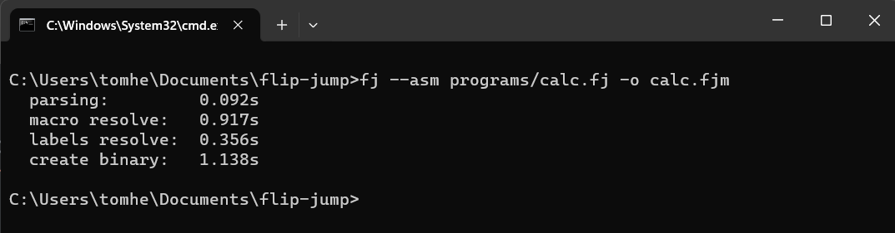
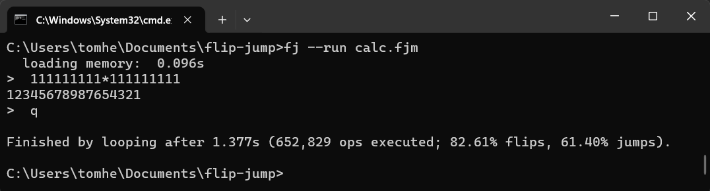
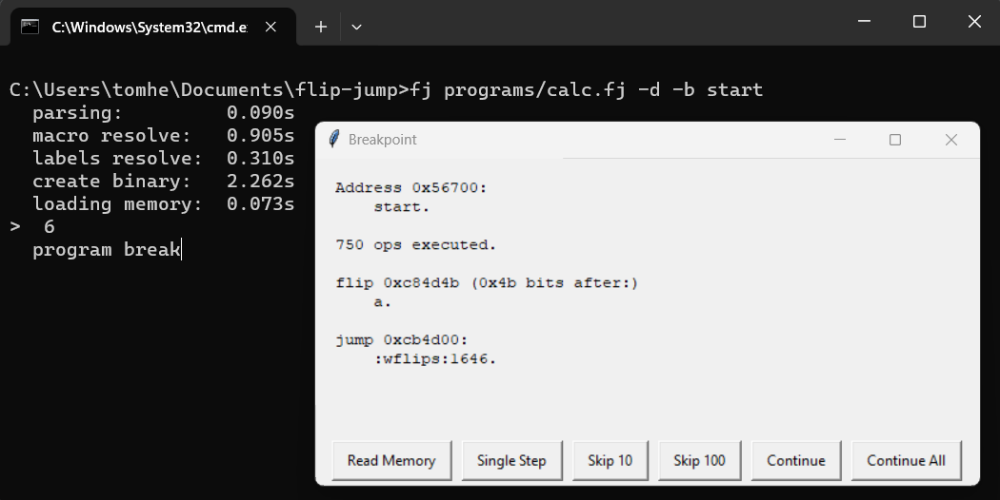
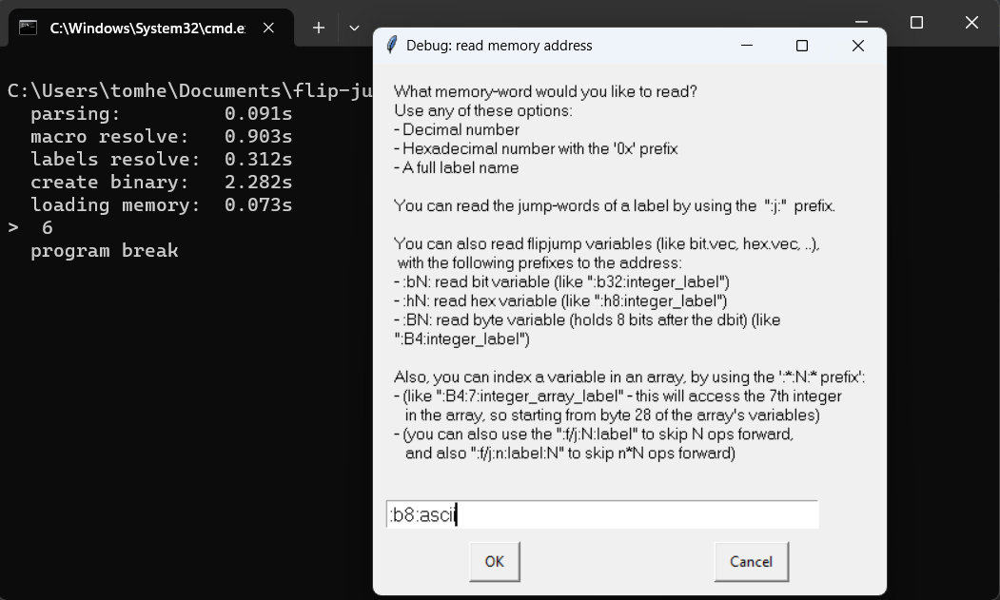
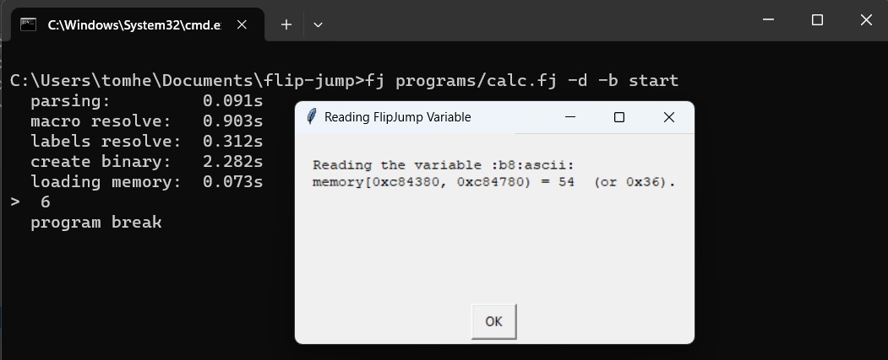

# FlipJump Source Code

In this documentation file you could find information about every python source file in the flipjump module.

> [Visualization of the flipjump codebase](https://mango-dune-07a8b7110.1.azurestaticapps.net/?repo=Tomhea%2Fflipjump)

## The FlipJump Macro-Assembler

The assembler has 4 steps:
- parsing the .fj text files into a dictionary of macros and their ops ([fj_parser.py](assembler/fj_parser.py)).
- resolving (unwinding) the macros (and reps) to get a straight stream of ops ([preprocessor.py](assembler/preprocessor.py)).
- resolving the label values and getting the ops binary data ([assembler.py](assembler/assembler.py)). 
- writing the binary data into the executable ([fjm_writer.py](fjm/fjm_writer.py)).

The whole process is executed within the [assemble()](assembler/assembler.py) function.

- The [ops.py](assembler/inner_classes/ops.py) file contains the classes of the different assembly ops.
- The [expr.py](assembler/inner_classes/expr.py) file contains the expression class (Expr), which is the code's representation of the assembly mathematical expressions. The expressions are based on numbers and labels.

## The FlipJump Interpreter

The Interpreter ([fjm_run.py](interpreter/fjm_run.py)) dispatches each run to one of three engines:

- **The native engine** ([_fjcore.c](interpreter/_fjcore.c)) - the run-loop in C, used automatically whenever its compiled module is present (prebuilt in the official wheels for Linux/macOS/Windows, every CPython >= 3.10; elsewhere `python build_fjcore.py`). ~100-300M fj-ops/s (`python tests/benchmark_interpreter.py`; history in [benchmark_results.md](../tests/benchmark_results.md)). Compact programs (all segments below the flat-storage limit, at w<=32) run over one dense flat array; sparse programs over lazily-allocated pages, so the footprint scales with the memory actually touched. `FLIPJUMP_NO_NATIVE=1` disables it.

  The flat-storage limit defaults to 2^23 words; set it with `fj --flat-max-words N`, `fjm_run.run(flat_max_words=)`, or the `FLIPJUMP_FLAT_MAX_WORDS` environment variable. It never affects per-op speed - only startup time and memory (8 bytes per word of span; an impossible allocation falls back to paged mode). The mode that ran is reported in the termination statistics line and as `TerminationStatistics.storage_mode`.
- **The pure-python fast loop** - the fallback when the native engine isn't built (~4M fj-ops/s). Stores the memory in a dictionary {address: value}, with the memory accesses and IO/termination checks inlined into the loop.
- **The featured loop** - used for tracing, breakpoints, and `--profile` (full per-op statistics). This is the loop the debugger runs on.

All three engines behave identically (same outputs, same termination causes, same op-counts - pinned by the test-suite), support unaligned-word access, and route IO through the same [io_devices](interpreter/io_devices). Devices can also read/write the running program's memory through the [device_memory.py](interpreter/io_devices/device_memory.py) hook - e.g. the screen device reads pixel data straight from the program memory.

The whole interpretation is done within the [run()](interpreter/fjm_run.py) function (also uses the [fjm_reader.py](fjm/fjm_reader.py) to read the fjm file - i.e. to get the flipjump program memory from the compiled fjm file).  
More about [how to run](../README.md#how-to-run).

### The Debugger

The Interpreter has a built-in CLI debugger, activated by specifying breakpoints (via the [breakpoints.py](interpreter/debugging/breakpoints.py) `BreakpointHandler`) - take a look at the [debugging documentation](interpreter/debugging/README.md).

### Macro Usage

The [macro_usage_graph.py](interpreter/debugging/macro_usage_graph.py) file exports a feature to present the macro-usage (which are the most used macros, and what % do they take from the overall flipjump ops) in a graph.  
In order to view it, run the assembler with `--stats` (requires plotly to be installed (installed automatically with `pip install flipjump[stats]`)).  
For example:

## The Using-FlipJump Files

- The [flipjump_cli.py](flipjump_cli.py) file is the main FlipJump cli-script. run with --help to see its capabilities. The `fj` utility runs the main() of this file.
- The [flipjump_quickstart.py](flipjump_quickstart.py) file contains the fundamental assemble/run functions that are exposed to the users. They are wrappers to the inner api. These are the functions that will be exported when you `import flipjump`.

### FJM versions

The .fjm file currently has 4 versions:

- Version 0: The basic version
- Version 1: The normal version (more configurable than the basic version)
- Version 2: The relative-jumps version (good for further compression)
- Version 3: The compressed version

You can specify the version you want with the `-v VERSION` flag.  
The assembler chooses **by default** version **3** if the `--outfile` is specified, and version **1** if it isn't. 

### Generated Label Names

The generated label string is a concatenation of the macro call tree, each separated by '---', and finish with the label local-name.

Each macro call string is as follows:\
short_file_name **:** line **:** macro_called

So if a->bit.b->hex.c->my_label: (a, bit.b called from file f2 lines 3,5; hex.c from file s1, line 72), the label's name will be:\
f2:3:a---f2:5:bit.b---s1:72:hex.c---my_label

On a rep-call (on index==i), the macro call string is:\
short_file_name : line : rep{i} : macro_called\
for example: f1:32:rep6:hex.print---f2:17:print_bit---print_label

the short_file_name is (by default) s1,s2,s3,... for the standard library files (in the order of [stl/conf.json - all](stl/conf.json)),
and f1,f2,f3,... for the compiled .fj files, in the order they are mentioned to the compiler (or appear in the test-line).

You can place breakpoints to stop on specific labels using the `-d`, followed by a  `-b` and a label name. You cal also use `-B` instead of `-d` in order to stop on all labels that contain a substring. 

For example stopping on the label "start":

Read memory (You can read the memory as if it was flipjump variables):

Notice that `:b8:ascii` is 0x36, which is the ascii of `'6'`, which was the input to the program:

## More Files

- The [fjm_consts.py](fjm/fjm_consts.py) contains the constants needed for interacting with the fjm format (used by the [fjm_reader.py](fjm/fjm_reader.py) + [fjm_writer.py](fjm/fjm_writer.py)).
- The [utils/](utils) folder contains common utilities used and shared by the entire project:
  - [utils/classes.py](utils/classes.py) - contains the common classes used in the entire project
  - [utils/functions.py](utils/functions.py) - contains the common utility functions used in the entire project
  - [utils/constants.py](utils/constants.py) - contains the project's constants and definitions.
  - [utils/exceptions.py](utils/exceptions.py) - contains all the project's exceptions.
- The [interpreter/io_devices/](interpreter/io_devices) folder contains modules for different Input/Output-handling classes (can be passed as a parameter to the interpreter). 
  - The standard one is [StandardIO.py](interpreter/io_devices/StandardIO.py), which takes its input from the standard input, and write its output to the standard output.
  - The tests use the [FixedIO.py](interpreter/io_devices/FixedIO.py), which takes a defined input and remembers its output.
  - If you want to assert that your program takes no input and generates no output, use the [BrokenIO.py](interpreter/io_devices/BrokenIO.py), which raises exception on every input/output.
  - Finally, the pure abstract IO handler class - [IODevice.py](interpreter/io_devices/IODevice.py).

# Read More

The FlipJump source is built in a way that allows simple addition of new features.

Every addition should be supported from the parsing level, up to the phase that is disappears (and probably is replaced with some flipjump ops). See the `assemble()` function in [assembler](assembler/assembler.py) to better understand the assembler 'pipeline'.

For example, if you want to add a new operation `a@b` that calculates _a^2+b^2_ or `a!` for _factorial(a)_, it is simple as adding a parsing rule in [fj_parser.py](assembler/fj_parser.py), and then adding the function to the op_string_to_function() in [expr.py](assembler/inner_classes/expr.py). That's it.

