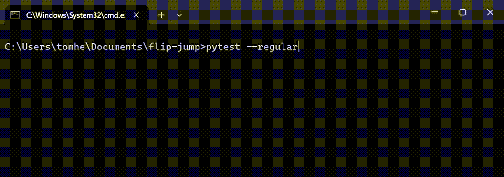
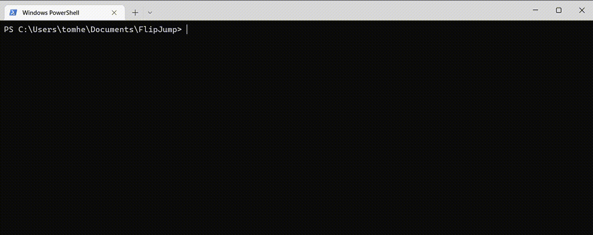

# The Testing Arena

## The CI
The project has a CI tests suit, that runs on each pull-request:
1. `--regular` tests for all supported python versions, for each os of windows, ubuntu, macos (using [tox](https://tox.wiki/)).
2. Linters: [mypy](https://mypy-lang.org/), [flake8](https://flake8.pycqa.org/en/latest/), [bandit](https://bandit.readthedocs.io/en/latest/), [black](https://github.com/psf/black).
   - They run on the latest supported python, on ubuntu.
3. `pytest --all` (the compile+run program tests) in parallel.
   - Runs on the latest supported python, on ubuntu.
   - The results are printed as a table in the workflow summery ([for example](https://github.com/tomhea/flipjump/actions/runs/7170673166/attempts/1#summary-19523946921)).
4. `pytest --unit-tests` (the [assembler/interpreter unit-tests](#the-unit-tests)) in parallel.
   - Runs on the latest supported python, on ubuntu, as its own job - in parallel with the program tests.

Any PR to the main branch must succeed in all of these tests, in order to be merged.

## Run the Linters
- `tox` - will run anything: all the linters + `pytest --regular` for all python versions + the full `pytest --all` + the [unit-tests](#the-unit-tests).
- `mypy` - search for types related errors.
- `flake8` - search for style and syntax errors.
- `bandit --ini tox.ini` - search for common security issues.
- `black . --check --color --diff` - search for code-formatting issues. 

# Run the tests:

**Run `test_parallel --all` to run all the tests, in parallel.**

Run `pytest --all` to run all the program tests.  
Run `pytest` to run the fast program tests.

Run with `--compile` / `--run` for testing only the compilation / the run.

Run `pytest --unit-tests` to run the [assembler/interpreter unit-tests](#the-unit-tests) (a separate, fast suite).

Add a combination of `--fast`, `--medium`, `--slow`, `--hexlib` to run tests of different types.  
Use `--regular` to run all the fast&medium tests.  
**====> Use `--all` to run all the tests. <====**  
The default (no type flags) means `--fast`.



You can run the tests parallel with `-n auto` (using [xdist](https://github.com/pytest-dev/pytest-xdist)).  
note that this option is only allowed while using exactly one of `--compile` / `--run`, or while using `--unit-tests`.  
You can execute the `test_parallel` / `test_parallel.bat` to run parallel compile, then parallel run, then the parallel unit-tests, with the given flags.

`test_parallel --all` example:


### Debugging info
When updating the codebase or adding new tests - Tests may fail, and it's a good thing. That way we can learn more about the code behavior. 
To get useful information out of failed tests (something like their macro-stack), you can use the `--debuginfo [LEN]` flag (Doesn't work when run in parallel).

When tests fail to complete their run (i.e. finished not by looping) the testing environment shows the last 10 executed addresses.
Using the `--debuginfo` flag adds debugging info, i.e. labels information; In that case, each of the 10 executed address will be followed by a label name like the one below.
You can also use this flag with a positive number `--debuginfo LEN` - that way the last `LEN` executed addresses will be saved (with their extensive label-names) and not just 10.

Using this flag makes the test run ~25% slower, and the compiled tests are 3-times larger (because of the debugging information). 
Yet, it's nothing compared to the debugging information you are getting: 

###### Example label name you'll get with using `--debuginfo [LEN]`:
```
  0x2c6000:
    f1:l13:hex.pop_res(1) ->
     s20:l268:hex.xor_from_ptr(2) ->
      s20:l159:hex.exact_xor_from_ptr(2) ->
       s20:l175:hex.ptr_wflip_2nd_word(2) ->
        s20:l144:hex.ptr_wflip(2) ->
         s20:l121:hex.pointers.set_flip_pointer(1) ->
          s20:l43:hex.address_and_variable_xor(4) ->
           s12:l86:rep0:hex.double_exact_xor(9) ->
            first_flip
```
That means that address 0x2c6000 is the label _first_flip_ in the _double_exact_xor_ macro (that gets 9 parameters). 
This macro got "called" from the _address_and_variable_xor_ macro (4 params) in the 86th line in the 12th stl file (in the compilation order; s stands for stl, while f stands for other files).
The current macro-expansion started in the first non-stl compiled file, in line 13, where hex.pop_res is called with 1 param.

You can get the entire "macro-stack" of the last executed addresses to get a better understanding of what happened.

More information about the labels can be found [here](../flipjump/README.md#generated-label-names).

More information about debugging with flipjump in general: [how to debug](../README.md#how-to-debug).

### Filter tests by their name 

You can filter the running tests. No filter means that all the tests in the chosen test type (--regular, --all, etc.) will run.  
Using the next filters together will take the union of the relevant tests.
 * `--name n1 n2` only run tests with these exact names.
 * `--contains n1 n2` only run tests containing one of these names.
 * `--startswith n1 n2` only run tests starting with one of these names.
 * `--endswith n1 n2` only run tests ending with one of these names.

## The Unit Tests

Alongside the program tests above (which compile and run whole .fj programs end-to-end), the
[unit/](unit) directory holds focused unit-tests for the assembler and interpreter internals.
They are plain, pure-python pytest functions (no .csv catalog), and the whole suite runs in ~1s.

Run them with `pytest --unit-tests` (add `-n auto` to parallelize, as the `test_parallel` script does).

In summary, they check:

| file                                            | what it checks                                                                                                  |
|-------------------------------------------------|-----------------------------------------------------------------------------------------------------------------|
| [test_expr.py](unit/test_expr.py)               | the `Expr` arithmetic-tree: every math operator, resolution, and the failures (division-by-zero, unknown label) |
| [test_parser.py](unit/test_parser.py)           | the lexer: number formats (dec/hex/bin), char/string literals & escapes, and comment handling                   |
| [test_preprocessor.py](unit/test_preprocessor.py) | macro parameter-binding, rep-count evaluation, and the used/declared-label collectors                         |
| [test_assembler.py](unit/test_assembler.py)     | each language rule compiles into a valid .fjm, and the error/edge cases raise the right exception               |
| [test_fjm.py](unit/test_fjm.py)                 | the .fjm Writer/Reader: round-trips (all versions × widths), relative-jumps, garbage-handling, and corrupt files |
| [test_io_devices.py](unit/test_io_devices.py)   | the IO devices: `FixedIO` bit-ordering/EOF/incomplete-output, and `BrokenIO`                                     |
| [test_interpreter.py](unit/test_interpreter.py) | the run-loop: each termination cause, the input/EOF path, and the last-ops debugging deque                       |
| [test_utils.py](unit/test_utils.py)             | the shared utilities: debug-label round-trip, file helpers, and the run-statistics counters                     |
| [test_cli.py](unit/test_cli.py)                 | the command-line entry-point, and the .fjm-version defaulting/validation                                         |
| [test_quickstart.py](unit/test_quickstart.py)   | the high-level API end-to-end: `assemble_and_run` across the versions and memory-widths                         |
| [test_fast_run.py](unit/test_fast_run.py)       | the pure-python fast loop matches the featured loop                                                              |
| [test_native_memory.py](unit/test_native_memory.py) | the native engine memory: lazy footprint, the flat-storage limit knobs, and `storage_mode`                  |
| [test_parse_cache.py](unit/test_parse_cache.py) | the assembler's stl-prefix parse cache: hits, invalidation, and bit-identical outputs                            |
| [test_breakpoints.py](unit/test_breakpoints.py) | the debugger machinery: breakpoint resolution, debug actions, memory/variable reading, and an E2E break          |
| [test_cli_debugger.py](unit/test_cli_debugger.py) | the terminal prompts of the debugger (messages, text answers, choice picking)                                  |
| [test_device_memory.py](unit/test_device_memory.py) | the device<->memory hook over both engines                                                                  |
| [test_keyboard_io.py](unit/test_keyboard_io.py) | the keyboard device: the status-hex protocol and scripted event files                                            |
| [test_screen_io.py](unit/test_screen_io.py)     | the headless screen device: the command stream, palettes, PNGs, and frame hashes                                 |
| [test_screen_window.py](unit/test_screen_window.py) | the interactive screen window (headless via the SDL dummy driver): presenting, live keys, fullscreen, closing |
| [test_devices_e2e.py](unit/test_devices_e2e.py) | .fj programs driving the screen/keyboard devices end-to-end, and the complete `PcIO` device      |

To add a unit-test, just add a `test_*` function to the relevant file (or a new `test_*.py` module)
under [unit/](unit) - the shared helpers live in [unit_utils.py](unit/unit_utils.py).

## Add your tests:

The .csv files in this directory specify which tests to run (and what parameters to use). 

A test is a .fj program that gets compiled into a .fjm file, which gets run with a predefined input, and checks if it finished successfully with the desired output.

To support more .csv files, update [conf.json](conf.json).  
The python test itself can be found on [test_fj.py](test_fj.py) (and [conftest.py](conftest.py)).

To add a new test, create your .fj programs, and you predefined input and expected output.

Then choose the relevant csv file.  
The rule of thumb (for the sum of compile+run times, in seconds):

| fast         | medium         | slow | hexlib         |
|--------------|----------------|------|----------------|
| 0 &rarr; 0.2 | 0.2 &rarr; 0.7 | 0.7+ | tests `ns hex` |

Then add a new line to the relevant compile-csv and run-csv files, according to the next formats.

### Compile CSVs format:

(files with the next format: ```tests_tables/test_compile_*.csv```)

| test name    | .fj paths                                                   | out .fjm path                | memory width | version | flags | use stl | treat warnings as errors |
|--------------|-------------------------------------------------------------|------------------------------|--------------|---------|-------|---------|--------------------------|
| example_test | path/to/example_1.fj &#124; ... &#124; path/to/example_n.fj | path/to/compiled/example.fjm | 64           | 1       | 0     | True    | True                     |

Every line in this file will cause the compilation of the specified .fj files into the .fjm file, with the given compilation parameters.

Note that you can specify a single file, or a '|' separated list of files in the .fj paths cell. In case of a list, they will be compiled in the inserted order.

### Run CSVs format:

(files with the next format: ```tests_tables/test_run_*.csv```)

| test name    | .fjm path                    | input file path           | output file path            | is input a binary file | is output a binary file |
|--------------|------------------------------|---------------------------|-----------------------------|------------------------|-------------------------|
| example_test | path/to/compiled/example.fjm | path/to/inputs/example.in | path/to/outputs/example.out | False                  | False                   |

Every line in this file will cause the specified .fjm to run with the given input, and its output will be compared to the given expected output.

Note that you can also emit specifying a file in the input/output cell, and leave it empty. In that case an empty input/output will be used.

### Xfail Lists

If you want to add your test, but you want it to [xfail](https://docs.pytest.org/en/7.1.x/how-to/skipping.html#xfail-mark-test-functions-as-expected-to-fail), you can add your test name (in its own line) to:
- ```tests_tables/xfail_compile.csv``` - to mark its compilation as expected to fail.
- ```tests_tables/xfail_run.csv``` - to mark its run as expected to fail.
